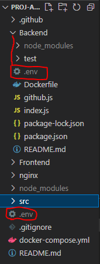

[](https://coveralls.io/github/PROJ-A2022-G06-AWS-2-Cloud-Organization/PROJ-A2022-G06-AWS-2-Cloud-WebDev?branch=main)

# PROJ-A2022-G06-AWS-2-Cloud-WebDev
GitHub Repository for the Web Development proportion of this project

# Local environment setup

To access GitHub repo where our AWS application templates are located you need to set up the environment variables to have proper GitHub access token. This is referred to as ```AWS_GIT_TOKEN``` in the code.

This can be done by placing ```.env``` file shared in the team OneDrive to root level **AND** Backend folder level (see picture). If you can't find the file ask from Kosti about it.


# Docker compose run
Application starts with:
```
docker-compose up -d --build
```

Backend is left open, for now.

Frontend can be reached in: http://localhost
Backend can be reached in: http://localhost/api

# Local development run
```
bash startup.sh
```

localhost:5000 has now the frontend available.
